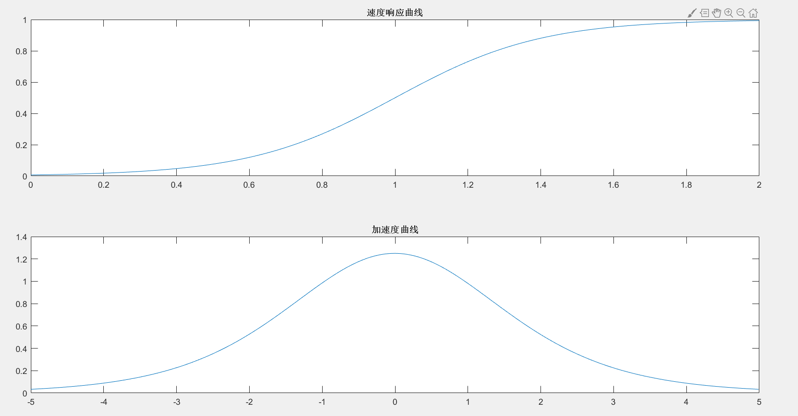
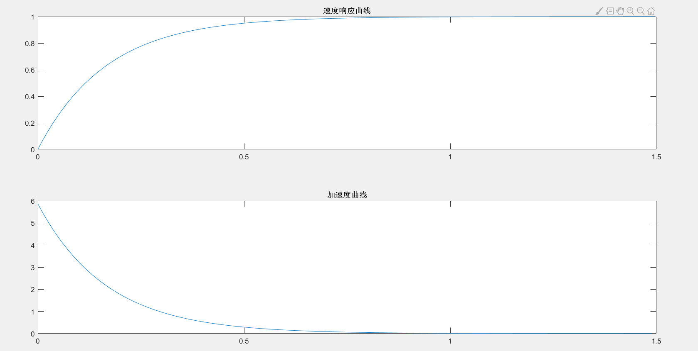
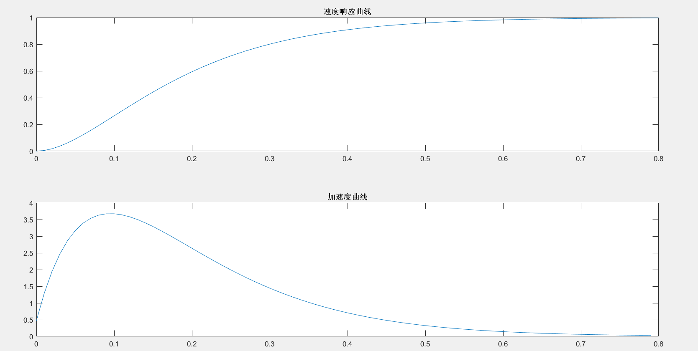
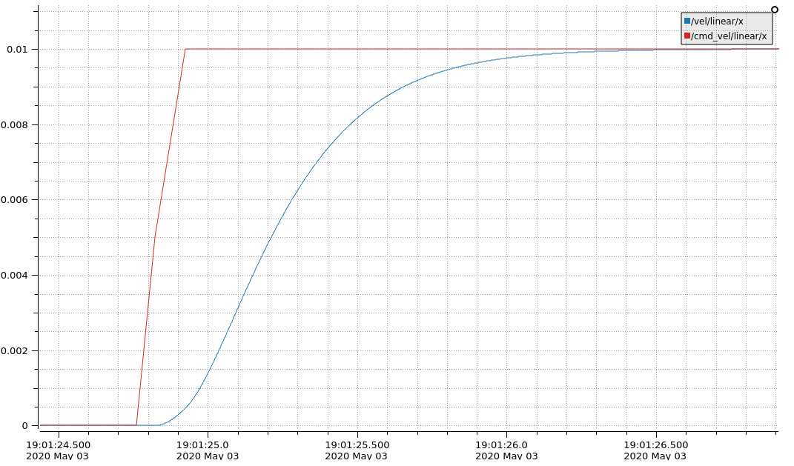
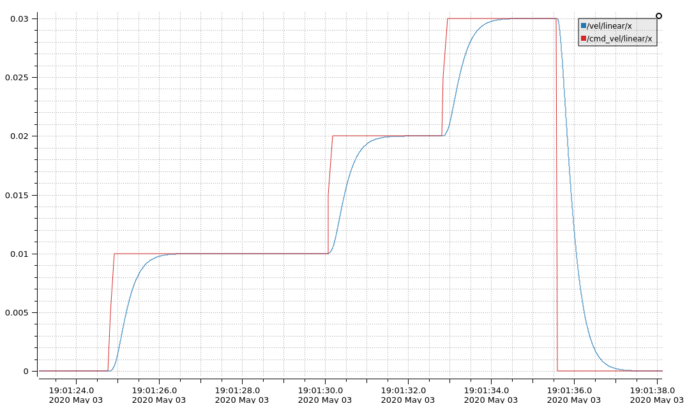

<!--
 * @Descripttion: 
 * @version: 
 * @Author: Zhangjianqing
 * @Date: 2020-05-02 19:13:40
 * @LastEditors: Zhangjianqing
 * @LastEditTime: 2020-05-03 19:22:40
 -->
## 基于二阶滤波方法的遥控信号平滑处理

使用遥控器控制机器人运动时，若将遥控信号直接转换为速度信息，常常会引起机器人的急加/减速。这主要是由于遥控信号存在阶跃特性（如速度从0.1m/s突然增大到0.2m/s），大的阶跃信号直接作用于电机时，瞬时加/减速度较大，使得整车运动不够平顺。因此本文对遥控信号进行滤波后作用于电机，达到速度平滑的作用。

### 阻尼器
所谓滤波，即对信号进行平滑。对于遥控信号，可理解为在信号输入时增加阻尼器，阻尼器使得响应滞后，达到滤波效果。对于阻尼器的设计，输入是阶跃信号，研究阻尼器系统对阶跃信号的响应即可。
### 理想响应过程

理想响应过程如下图所示：



系统的响应过程加加速度和加减速度阶段互相对称，且加速度连续变化，速度较为平滑，可使用sigmoid函数进行变换：

$$f(x)=\frac{1}{1+e^{x-b}}$$
其中$b$为坐标偏移。
然而由于sigmoid函数无法进行拉氏变换，因此无法使用其特性进行滤波。
### 一阶系统
一阶系统传递函数：
$$G(s)=\frac{a}{s+a}$$
系统阶跃响应如下图所示：



从响应曲线来看，在加速度过程中，加速度在0时刻存在瞬间突变，其他过程为加减速过程，可能导致最终速度的不连贯性。
### 二阶系统
二阶系统传递函数为:
$$G(s)=\frac{w^2_n}{s^2+2\xi w_ns+w^2_n}$$
设定阻尼比$\xi=1$，系统处于临界阻尼状态。系统阶跃响应如下图所示：


从图中可以看出，相较于一阶系统，加速度曲线无突变，呈现连续变化的趋势；与sigmod函数相比，加加速度和加减速度过程不对称，达不到理想状态。
### 实现

本文使用C++进行实现，在ROS上观察效果。

实现时，阻尼器使用IIR滤波器结构，源码参照[IIR滤波器的C++实现](https://blog.csdn.net/liyuanbhu/article/details/38849897)

遥控端使用turtlebot3_teleop节点，接收节点为filter_node。

首先在code目录下，使用catkin_make进行编译。然后启动turtlebot3_teleop节点：
```
roslaunch turtlebot3_teleop turtlebot3_teleop_key.launch
```
接着启动接收节点
```
roslaunch filter_node filter_node.launch
```
通过PlotJuggler进行数据查看，加速和加减速过程响应曲线如下图所示：





